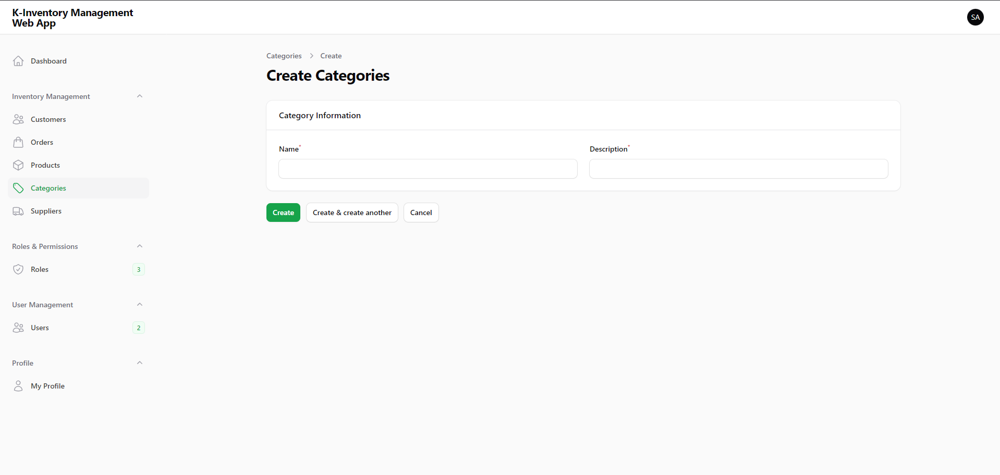
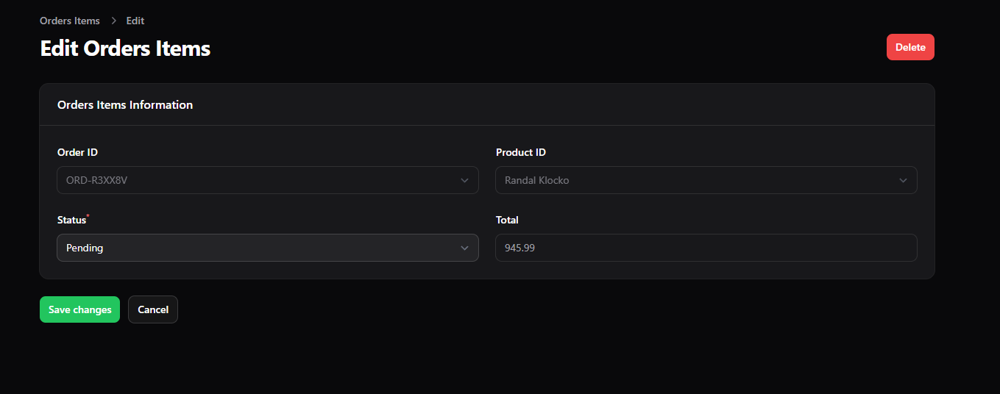

# Application Overview
This document provides an overview of the application overview. For detailed information, visit the [Wiki](https://github.com/KrisChan33/K-Employee-Management-Web-App/wiki).

---
## Home Page

---

## Login/Register
 Dark Mode: 
 Light Mode: 
 Registration Page: 
# Admin Panel

### Features

The Admin Panel is accessible to the super admin and includes:

- **Super Admin Navigation Groups**:
  - User Management
  - Spatie (Roles & Permissions)

- **User Roles**:
  - Super Admin (controller access)
  - Staff

- **Security**:
  - Two-Factor Authentication (2FA) for enhanced security
---

## Navigation Groups

### Product Management
- **Products**: Manage product information.
  -  Add, update, and delete products.

- **Categories**: Manage category information.
  -  Add, update, and delete product categories.

- **Suppliers**: Manage supplier information.
  -  Add, update, and delete suppliers.

### Customer Management
- **Customers**: Manage customer records.
  -  Add, update, and delete customers.

### Order Management
- **Orders**: Manage order information.
  -  Create, view, update, and delete orders.

- **OrderItems**: Manage order item details.
  -  Add, update, and delete items within an order.

### User Management
- **Users**: Manage user information.
  -  View, update, and manage user roles and permissions.

---

### User Roles and Permissions

- **Admin**:
  - Can create, read, update, and delete (CRUD) all records.
  - Has access to all controllers and can manage all resources.
  - Can enable or disable 2FA.
  - Can enable or disable light/dark mode.

- **Staff**:
  - Can view any records in Customers, Orders, Order Items, Products, Suppliers, and own Profile Information.
  - Can create records in Orders, Order Items, and Products.
  - Can delete Orders, Order Items, Products, and own Profile Information.
  - Can update records in Orders, Order Items, Products, and own Profile Information.
  - Can enable or disable 2FA.
  - Can enable or disable Light/Dark Mode.
  - Cannot delete records or access admin-specific controllers.
--- 

# Nav for  (Admin)
### Admin Dashboard

### Admin Navigation

### Customer (Table)
 

### Customer (Form)

### Order (Table)

### Order (Form)

### Order Item (Table)

### Order Item (Form)

### Product (Table)

### Product (Form)

### Category (Table)

### Category (Form)

### Supplier(Table)

### Performance Review Controller (Form)

<!-- 
### Performance Review Controller (Table)

### Performance Review Controller (Form)
 -->

---

# Staff 

### Features

The Staff is accessible to the  panel user and includes:

- **Security**:
  - Two-Factor Authentication (2FA) for enhanced security
---
### Staff Navigation Groups

### Product Management
- **Products**: Manage product information.
  -  Add, update, and delete items within an product.

- **Categories**: View category information.
  - Can view/viewany product categories.

- **Suppliers**: View supplier information.
  -  Can view/viewany suppliers.

### Customer Management
- **Customers**: View customer records.
  -  Can view/viewany customers.

### Order Management
- **Orders**: Manage order information.
  -  Create, view, update, and delete orders.

- **Order Items**: Manage order item details.
  -  Add, update, and delete items within an order.
---

### User Roles and Permissions

- **Staff**:
  - Can view any records in Customers, Orders, Order Items, Products, Suppliers, and own Profile Information.
  - Can create records in Orders, Order Items, and Products.
  - Can delete Orders, Order Items, Products, and own Profile Information.
  - Can update records in Orders, Order Items, Products, and own Profile Information.
  - Can enable or disable 2FA.
  - Can enable or disable Light/Dark Mode.
  - Cannot delete records or access admin-specific controllers.
--- 

### Staff Dashboard

### Staff Nav

## Navigations Groups

### Customer (Table)

### Order (Table)

### Order (Form)

### Order Items (Table)

### Order Items (Form)

### Product (Table)

### Product (Form)

### Category (Table)

### Supplier (Table)

---

### Edit Profile
Users and Admin have similar profile-editing options as including photo management.

---asdas

### 2FA Authentication

---

## Default Permissions for 'super_admin'

- Select all

## Default Permissions Needed to set for 'panel_user'
  Only check the list below for default staff permission.

---

## Default Credentials
- For an overview of the Default Credential and its navigation options, visit the Default [Default Credentials Wiki](https://github.com/KrisChan33/K-Inventory-Management-Web-App/wiki/5.-Default-Credentials).

## Database and Zip File
- Refer to the [Database Wiki ](https://github.com/KrisChan33/K-Inventory-Management-Web-App/wiki/6.-Database) for instructions on importing the database and extracting resources.

## Requirements

- Ensure your system meets the following requirements before starting. For more details, see the [ Requirements Wiki](https://github.com/KrisChan33/K-Inventory-Management-Web-App/wiki/7.-Requirements).

## Instructions
- Complete installation and setup instructions are available in the [Setup Requirements Wiki.](https://github.com/KrisChan33/K-Inventory-Management-Web-App/wiki/8.-Instructions)

## Troubleshooting
- If you encounter missing `.env` or permissions errors, double-check file paths and server requirements.
- If `php artisan` commands fail, ensure PHP and Composer are installed and properly configured.

## License
 This project is licensed under the Apache 2.0 License - see the [LICENSE](LICENSE) file for details.
 
---
End of document.